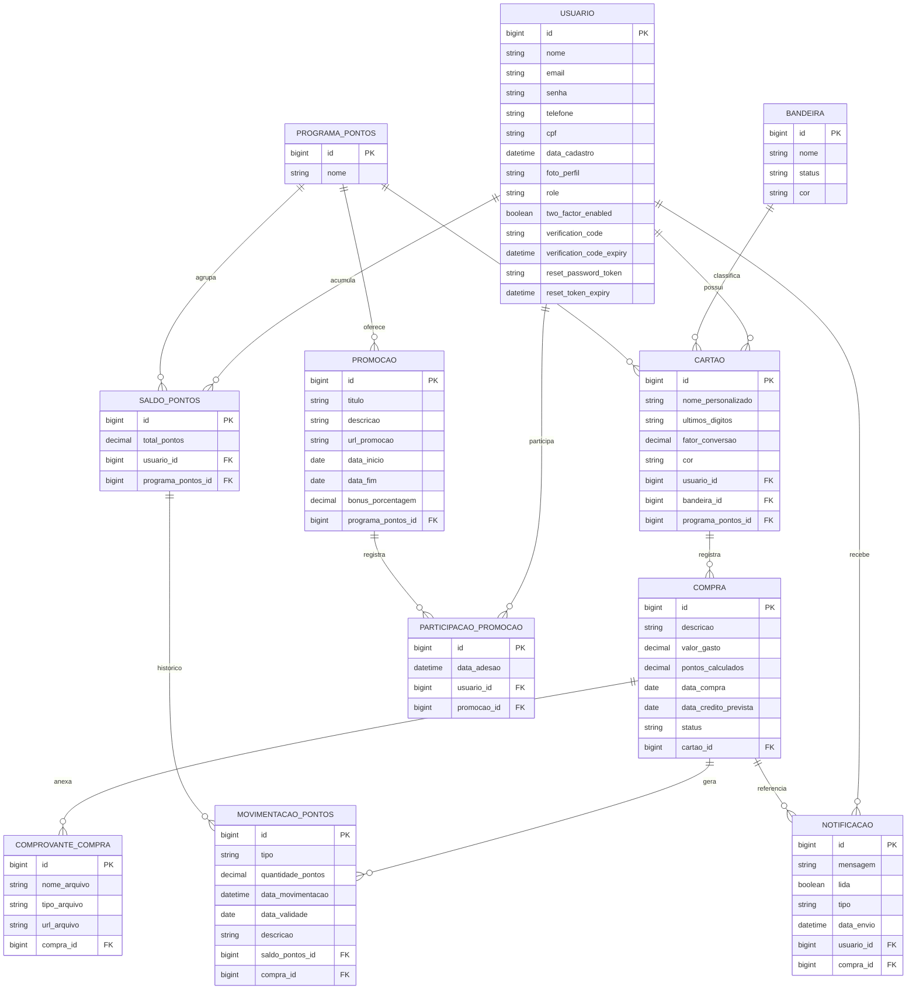

# Milhas Web API — Backend


API REST para gerenciamento de acumulacao de pontos e milhas de cartoes de credito, desenvolvida com Java 21 e Spring Boot 3.

---

## Sobre o Projeto

Sistema desenvolvido como projeto academico na disciplina de Projeto Web I do Instituto Federal de Sergipe (IFS). A aplicacao permite o cadastro de cartoes com diferentes bandeiras e programas de fidelidade, o registro de compras, o calculo automatico de pontos com base no fator de conversao do cartao, a participacao em promocoes bonificadas e o acompanhamento de movimentacoes e saldos.

Este repositorio contem exclusivamente o back-end (API REST).

Repositorio front-end: [Projeto-Web-1-FrontEnd](https://github.com/flavio-ph/desenvolvimento-web-milhas-interface.git)

---

## Funcionalidades

- Autenticacao com JWT, recuperacao de senha por e-mail e suporte a autenticacao de dois fatores (2FA)
- Gerenciamento de cartoes com bandeiras e programas de pontos associados
- Registro de compras e calculo automatico de pontos com base no fator de conversao
- Deteccao de promocoes ativas e aplicacao de bonus de pontuacao
- Agendamento automatico para credito de pontos pendentes e alertas de expiracao
- Relatorios de movimentacoes em PDF e CSV
- Dashboard consolidado com saldo por cartao, prazo medio de recebimento e historico mensal
- Documentacao interativa via Swagger UI

---

## Tecnologias Utilizadas

| Camada         | Tecnologia                          |
|----------------|-------------------------------------|
| Linguagem      | Java 21                             |
| Framework      | Spring Boot 3.x                     |
| Seguranca      | Spring Security + JJWT 0.11.5       |
| Persistencia   | Spring Data JPA / Hibernate         |
| Banco de Dados | PostgreSQL 15                       |
| Migracao       | Flyway                              |
| Mapeamento     | MapStruct 1.5.5                     |
| Build          | Maven                               |
| Containerizacao| Docker / Docker Compose             |

---

## Estrutura do Projeto

```
src/
└── main/
    ├── java/com/web/milhas/
    │   ├── config/         # Configuracoes globais (CORS, seguranca, Swagger, rate limit)
    │   ├── controller/     # Endpoints REST
    │   ├── dto/            # Records de transferencia de dados (request/response)
    │   ├── entity/         # Entidades JPA mapeadas para o banco
    │   │   └── enums/      # Enumeracoes do dominio
    │   ├── repository/     # Interfaces Spring Data JPA
    │   ├── service/        # Regras de negocio
    │   └── security/       # Filtros e configuracoes JWT
    └── resources/
        ├── application.properties
        └── db/migration/   # Scripts Flyway
```

---

## Diagrama Entidade-Relacionamento



---

## Prerequisitos

- JDK 21
- Maven 3.8+
- PostgreSQL 15+
- Docker (opcional)

---

## Configuracao e Execucao

### 1. Clone o repositorio

```bash
git clone https://github.com/seu-usuario/desenvolvimento-webI-milhas.git
cd desenvolvimento-webI-milhas
```

### 2. Configure as variaveis de ambiente

As variaveis abaixo devem ser definidas no sistema operacional ou em um arquivo `.env`:

| Variavel                   | Descricao                        |
|----------------------------|----------------------------------|
| `SPRING_DATASOURCE_URL`    | URL JDBC do banco PostgreSQL     |
| `SPRING_DATASOURCE_USERNAME` | Usuario do banco               |
| `SPRING_DATASOURCE_PASSWORD` | Senha do banco                 |
| `JWT_SECRET`               | Chave secreta para tokens JWT    |

### 3. Execute a aplicacao

Via Maven:

```bash
./mvnw spring-boot:run
```

Via Docker Compose:

```bash
docker compose up --build
```

A API estara disponivel em `http://localhost:8080`.

---

## Documentacao da API

Com a aplicacao em execucao, acesse:

- Swagger UI: `http://localhost:8080/swagger-ui.html`
- OpenAPI JSON: `http://localhost:8080/v3/api-docs`

---

## Endpoints Principais

| Metodo | Rota                        | Descricao                          |
|--------|-----------------------------|------------------------------------|
| POST   | /auth/login                 | Autenticacao do usuario            |
| POST   | /auth/register              | Cadastro de novo usuario           |
| PUT    | /usuarios/{id}              | Atualizar perfil                   |
| GET    | /cartoes                    | Listar cartoes do usuario          |
| POST   | /cartoes                    | Cadastrar cartao                   |
| GET    | /compras                    | Listar compras                     |
| POST   | /compras                    | Registrar compra                   |
| GET    | /movimentacoes              | Historico de movimentacoes         |
| GET    | /saldo                      | Consultar saldo por programa       |
| GET    | /promocoes                  | Listar promocoes ativas            |
| GET    | /dashboard                  | Dados consolidados do dashboard    |
| GET    | /relatorios/extrato         | Extrato em PDF ou CSV              |

---

## Testes

```bash
./mvnw test
```

---

## Sobre

Projeto desenvolvido para a disciplina de Projeto Web I no Instituto Federal de Sergipe (IFS), com foco em boas praticas de API REST, seguranca com JWT e arquitetura em camadas.
